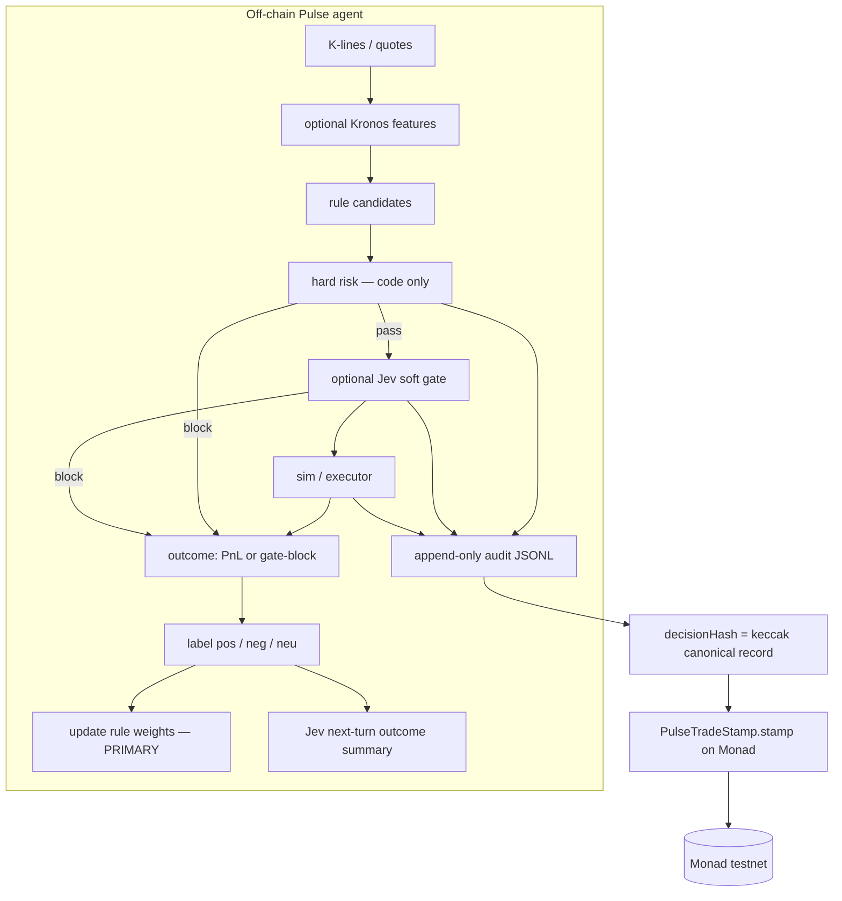

# Pulse on Monad

**Auditable off-chain trading agent** — an outcome-aware policy loop that stamps decision receipts on Monad via [PulseTradeStamp](contracts/src/PulseTradeStamp.sol), with a thin optional [ERC-8004](https://eips.ethereum.org/EIPS/eip-8004) identity shell.

[](https://testnet.monadvision.com/address/0x6eC692C5792AD122c459AC8Df3FDF67eE80842F4)
[](docs/metropolis.md)
[](agent/)
[](contracts/)
[](LICENSE)

链下策略闭环，风险代码硬拦，决策回执上 Monad。规则权重可适应；Kronos / Jev 不做在线训练。

## Pipeline

```
K-lines → (optional Kronos features) → rule candidates → hard risk (code only) → optional Jev soft gate → sim/executor
         ↘ append-only audit JSONL → decisionHash → PulseTradeStamp on Monad
Outcome (PnL / gate block) → label pos/neg → update rule weights (PRIMARY) → optional Jev next-turn outcome summary
Hard risk MUST NOT be loosened by the feedback loop (only same or stricter).
```



## What is audited vs what is on-chain

| | Off-chain JSONL | On-chain receipt |
| --- | --- | --- |
| Full step list, model ids/versions | yes | no |
| Inputs hashes + output summaries | yes | no |
| Hard-risk pass/fail + reason | yes | no (only that we reached `stamp`) |
| Jev prompt / verdict | yes, if the gate ran | no |
| `decisionHash` (keccak of canonical record) | yes (`content_hash` = `decision_hash`) | **yes** — `bytes32` |
| Symbol, size hint, action | yes | **yes** |
| `agentId` | `agent_id` field | **yes** — inside `note` (≤ 280 bytes) |
| Stamper + timestamp | file mtime only | **yes** — `msg.sender`, `block.timestamp` |

The chain stores a **receipt**, not the trade. Anyone can recompute keccak over the JSONL line and check it against `getReceipt(id).decisionHash`. Schema: [docs/audit-schema.md](docs/audit-schema.md).

## Closed loop (honest)

- **Rules adapt.** Labeled outcomes move strategy weights (`momentum`, `mean_reversion`, `conservative`). That is the PRIMARY loop.
- **Hard risk does not adapt looser.** Limits live in code. Feedback may keep them or tighten them (smaller max position / daily loss, longer cooldown, smaller allowlist). It cannot add symbols or raise caps.
- **Kronos is not online-trained here.** Optional feature sidecar; default is passthrough (`source=off`).
- **Jev is not online-trained here.** Optional TypeSafe soft gate (`jev-latest` via `/v1/systemone`). Without `TYPESAFE_API_KEY` / `JEV_API_KEY` it stubs `PASS` and still records the state (including a recent-outcome summary) for the next turn.

Planner → risk → executor follows the Pulse Agent split (conservative planner, fail-closed risk, sim executor). Risk never invents a trade.

## Deployed (Monad testnet)

| | |
| --- | --- |
| chainId | `10143` |
| RPC | https://testnet-rpc.monad.xyz |
| PulseTradeStamp | [`0x6eC692C5792AD122c459AC8Df3FDF67eE80842F4`](https://testnet.monadvision.com/address/0x6eC692C5792AD122c459AC8Df3FDF67eE80842F4) |
| Deployer | [`0x2e24006D3B0ad37687D71185efaFf165087aC776`](https://testnet.monadvision.com/address/0x2e24006D3B0ad37687D71185efaFf165087aC776) |
| Deploy tx | [`0x6d858c9d8d54a6b998a1d4128793cf80e2361ab0e9e92ecc5a2ecaa18bd1f7f1`](https://testnet.monadvision.com/tx/0x6d858c9d8d54a6b998a1d4128793cf80e2361ab0e9e92ecc5a2ecaa18bd1f7f1) |
| Explorer | https://testnet.monadvision.com/address/0x6eC692C5792AD122c459AC8Df3FDF67eE80842F4 |

Same table: [contracts/DEPLOYED-TESTNET.md](contracts/DEPLOYED-TESTNET.md).

Optional ERC-8004 Identity Registry on this chain: [`0x8004A818BFB912233c491871b3d84c89A494BD9e`](https://testnet.monadvision.com/address/0x8004A818BFB912233c491871b3d84c89A494BD9e). See [Identity shell](#erc-8004-identity-shell).

## Quick start (< 3 minutes)

Needs [Go 1.22+](https://go.dev/dl/) and [Foundry](https://book.getfoundry.sh/getting-started/installation).

```bash
git clone https://github.com/vincent-lxc/pulse-on-monad.git
cd pulse-on-monad

# contracts
cd contracts && forge test && cd ..

# agent
cd agent && go test ./... && go run ./cmd/pulse demo
```

`pulse demo` runs **one** simulated decision: mock BTC K-line → rules → hard risk → Jev stub → sim fill → JSONL line → **dry-run** `stamp` calldata → fake +1.50 PnL → weight update. It prints the keccak, calldata, and before/after weights. Hard risk numbers stay put. No key required.

Or: `make test` / `make demo`.

### Live stamp (Monad testnet)

Dry-run is the default (CI / local). To **broadcast** `PulseTradeStamp.stamp` after the audit line:

```bash
cp .env.example .env          # then edit — never commit .env
# .env must include:
#   PRIVATE_KEY=0x...         # throwaway testnet key only
#   MONAD_RPC_URL=https://testnet-rpc.monad.xyz
#   PULSE_TRADE_STAMP=0x6eC692C5792AD122c459AC8Df3FDF67eE80842F4

set -a && source .env && set +a
cd agent && go run ./cmd/pulse demo --live
# equivalent: PULSE_STAMP_LIVE=1 go run ./cmd/pulse demo
```

**Warn:** `--live` spends **testnet MON** from `PRIVATE_KEY`. Use a dedicated throwaway wallet. Do not use a mainnet or funded-production key. Fund the address on Monad testnet first.

On success the CLI prints `tx=0x…`, the explorer URL (`https://testnet.monadvision.com/tx/…`), `receipt_id`, and whether `getReceipt(id).decisionHash` **MATCH**es the audit keccak.

## Receipts web

Read-only page for judges. No private key. It calls `nextId` and `getReceipt` on the deployed PulseTradeStamp, then fills MonadVision tx links from `Stamped` logs.

```bash
cd web && python3 -m http.server 8080
# open http://127.0.0.1:8080
```

Or `make receipts`.

What you see: the latest receipts (default 8) with **id**, **symbol / note** (symbol id `1` is the demo BTC quote; the chain stores the number plus `note`), **action** (`hold` / `buy` / `sell`), **decisionHash**, a tx link when the log is found, and the stamp time. Look up any id in the form, or open `http://127.0.0.1:8080/?id=4`. Receipts 3 and 4 on the public testnet deployment should resolve.

Defaults are the Monad testnet contract. Override with query params: `?rpc=` `?contract=` `?chainId=` `?n=` `?id=`.

Smoke check (no network) and optional live read:

```bash
cd web && node --test receipts.test.mjs
PULSE_LIVE_SMOKE=1 node --test receipts.live.test.mjs
```

## Environment

Copy `.env.example`. **Never commit a real key.**

| Variable | Default | Purpose |
| --- | --- | --- |
| `MONAD_RPC_URL` | `https://testnet-rpc.monad.xyz` | JSON-RPC |
| `MONAD_CHAIN_ID` | `10143` | EIP-155 chain id |
| `PULSE_TRADE_STAMP` | `0x6eC692C5792AD122c459AC8Df3FDF67eE80842F4` | Receipt contract |
| `PRIVATE_KEY` | _(empty)_ | Live `stamp` only (never commit) |
| `PULSE_DRY_RUN` | `true` | Encode calldata; do not send |
| `PULSE_STAMP_LIVE` | unset | Set `1` (or pass `--live`) to broadcast |
| `PULSE_LIVE_STAMP` | unset | Legacy alias of `PULSE_STAMP_LIVE` |
| `PULSE_AGENT_ID` | `pulse-demo` | Written to audit + stamp `note` |
| `PULSE_DATA_DIR` | `./data` | JSONL + `policy.json` |
| `TYPESAFE_API_KEY` | _(empty)_ | Native TypeSafe Jev; stub if unset |
| `JEV_API_KEY` | _(empty)_ | Alias for `TYPESAFE_API_KEY` |
| `TYPESAFE_JEV_URL` | `https://api.typesafe.ai/v1/systemone` | Override / optional Vercel gateway |
| `TYPESAFE_JEV_MODEL` | `jev-latest` | Jev model id |
| `TYPESAFE_JEV_THRESHOLD` | `0.5` | `allow_action` noul pass cut |
| `CMC_API_KEY` | _(empty)_ | Reserved for a live quote adapter |
| `KRONOS_SIDECAR_URL` | _(empty)_ | Optional feature sidecar |
| `ERC8004_IDENTITY_REGISTRY` | `0x8004A818…BD9e` | Identity Registry |
| `ERC8004_AGENT_URI` | _(empty)_ | Agent card URI (stub) |
| `ERC8004_AGENT_WALLET` | _(empty)_ | Settlement wallet (stub) |
| `ERC8004_AGENT_ID` | _(empty)_ | ERC-721 `agentId` after register |

## Native TypeSafe Jev

Soft gate only. **Hard risk stays in Go and always runs first.**

When `TYPESAFE_API_KEY` (or alias `JEV_API_KEY`) is set, the agent `POST`s
[`https://api.typesafe.ai/v1/systemone`](https://api.typesafe.ai/v1/systemone)
with `Authorization: Bearer …`, `model: jev-latest`, a `state` string (intent +
recent outcome summary), and Pulse questions:

| id | type | meaning |
| --- | --- | --- |
| `allow_action` | noul | should this action proceed after hard risk passed? |
| `confidence` | score | how confident should Pulse be? |

`allow_action.noul >= TYPESAFE_JEV_THRESHOLD` (default `0.5`) → pass; otherwise the
executor holds. HTTP errors fail-closed. The audit step stores model id and a
question I/O **summary** — never the API key.

```bash
# stub (default / CI)
go run ./cmd/pulse demo

# real Jev when the key is in the environment
export TYPESAFE_API_KEY=…          # or JEV_API_KEY
go run ./cmd/pulse demo            # uses HTTP
go run ./cmd/pulse demo --jev      # refuse to stub if the key is missing
```

Optional **Vercel gateway**: point `TYPESAFE_JEV_URL` at that host’s
`/v1/systemone` path. Native TypeSafe is the default; the gateway is not required.

Jev is not online-trained in this repo. Pin `TYPESAFE_JEV_MODEL=jev-1.13.0` if
you need a frozen threshold.

## ERC-8004 identity shell

Pulse stamps **without** minting an agent NFT. The `erc8004` package is a config + registration-file stub:

1. Publish an [ERC-8004 registration file](https://eips.ethereum.org/EIPS/eip-8004) (`type`, `name`, `description`, `image`, `services`, `registrations`).
2. From a funded wallet on Monad testnet:

   ```bash
   cast send 0x8004A818BFB912233c491871b3d84c89A494BD9e \
     "register(string)" "ipfs://<cid>" \
     --rpc-url https://testnet-rpc.monad.xyz \
     --private-key $PRIVATE_KEY
   ```

3. `agentId` is the ERC-721 `tokenId`. Global id: `eip155:10143:0x8004A818BFB912233c491871b3d84c89A494BD9e / <agentId>`.
4. Keep `agentURI` + `agentWallet` in env. CI never mints.

## Metropolis

Track 01 — **Onchain Finance & Trading**. Pitch, non-claims, and judge path: [docs/metropolis.md](docs/metropolis.md).

## Layout

```
contracts/     PulseTradeStamp (Foundry) + deployed addresses
agent/         Go 1.22 module — audit, outcome, policy, stamp, demo CLI
agent/erc8004  optional identity shell (no live mint)
web/           static receipts page (read-only RPC)
docs/          audit schema + Metropolis write-up
```

## License

[MIT](LICENSE)
